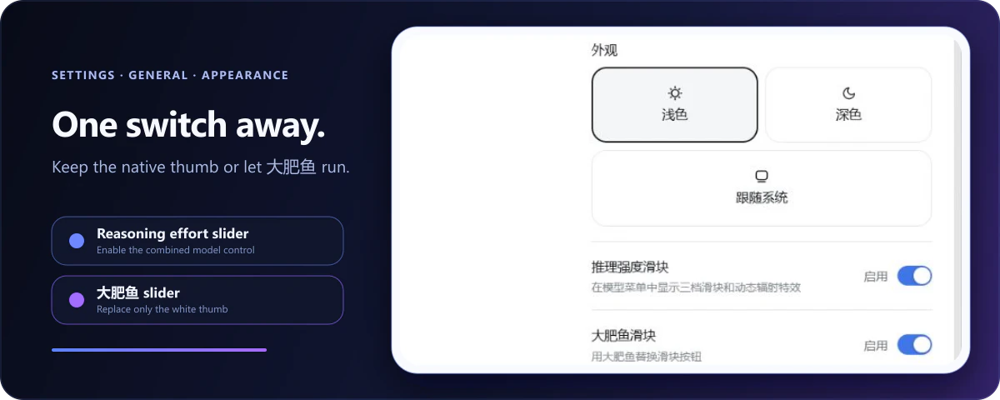

# dsh-reasoning-effort

[中文](README.md) · [Source](https://github.com/Missher12/dsh-reasoning-effort) · [Issues](https://github.com/Missher12/dsh-reasoning-effort/issues) · [Design sources](design/depth-slider/README.md)

Model selection and a thinking-depth slider for DeepSeek Harness. The public customization **0.7.5-local.4** targets **DSH 0.2.0-rc.1**; other Host versions are unverified. See [FORK.md](FORK.md) for upstream attribution and MIT licensing.

- A single card, plain white thumb, and top-level pixel field. Preset and custom colours live only in General Settings.
- Seven visual stops map to model-declared values. The model's highest supported value sits at the right edge; rejected selections roll back.
- Drag frames are coalesced and release commits once. A fixed-height label row keeps the track stationary when mapping hints change.
- Light and dark themes, Chinese and English, reduced motion, and custom-model declaration guidance.

## Install and update

This repository includes built Host and Client modules. Add its GitHub address in the DSH plugin manager and enable it in your chosen profile. Follow the Host's restart notice and refresh the interface. Source availability or package installation alone does not verify Loader activation or provider behaviour.

The package declares `dsh.bundle.patch` and needs no extra compatibility plugin. See [CONTRIBUTING.md](CONTRIBUTING.md) for builds and packaging, or open [design/depth-slider/index.html](design/depth-slider/index.html) for the standalone design. Preview colour controls are demonstration tools; the DSH colour controls remain in Settings.

## Where the levels come from

The slider reads `reasoning.efforts` from the current model in DSH's model directory. The model and route determine the count, names, and order. Levels are not fixed to three steps and can differ between endpoints.

The slider appears when at least two levels are available; otherwise the menu shows a notice. DSH validates and dispatches the selected value, so the plugin cannot bypass model or deployment limits.

## Declaring levels for any custom model

This section is vendor-neutral and applies to every model you declare yourself under `llm-pi-ai`.

**Why the levels are missing**: DSH's model directory only reports what the adapter declares. A model you declare has no catalog entry, so the directory exposes no levels — and no slider — until you write `reasoningEfforts`.

**What to write**: open the configuration file shown in the guidance panel (older builds use `settings.yaml`; DSH `0.2.0-rc.1` uses the profile's `cordis.patch.yml`). Add `reasoningEfforts` under the model's `llm-pi-ai` entry, matching its existing indentation. Each key is a DSH level, each value is the spelling the endpoint accepts, and a level left out counts as unsupported:

```yaml
models:
  - id: <your model id>
    reasoningEfforts:
      low: "<value the endpoint accepts>"
      high: "<value the endpoint accepts>"
```

**When to add `compat`** (beside `reasoningEfforts`, only when the endpoint needs it):

| Endpoint behaviour | What to add |
| --- | --- |
| expresses effort directly through `reasoning_effort` | nothing |
| needs its thinking switch turned on first | `compat.thinkingFormat`: `"qwen"` (sends `enable_thinking`) / `"zai"` / `"deepseek"` |
| does not accept `reasoning_effort` | `compat.supportsReasoningEffort: false` |
| fails with 400 `invalid_parameter_error` | `compat.supportsDeveloperRole: false` |
| fails while replaying history | `compat.requiresReasoningContentOnAssistantMessages: true` |
| does not reason at all | `reasoningEfforts: false` |

With no `compat`, the adapter decides from the endpoint address: an address it does not recognize is treated as standard OpenAI, and a recognized vendor endpoint gets that vendor's format automatically. **Guessing the format is worse than leaving it out.**

**How to verify**: open the model menu after saving — the slider appearing means it worked. If the slider appears but requests fail, work through the table above. The plugin's built-in knowledge entries are shortcuts, not a requirement.

## Effort guidance for custom providers

Built-in routes get their levels from the pi-ai catalog and the plugin never touches them. Only models you declare yourself in `llm-pi-ai` receive guidance:

1. Open the model menu. If the current model is your own declaration and the directory exposes no levels (or the declaration disagrees with the knowledge base), a **View declaration guidance** entry appears.
2. The panel shows suggested levels (from the knowledge base or a generic template), YAML indented for the active configuration file, its path, and the model entry location.
3. Follow the panel's replace or insert instruction for the matching `- id:` entry, preserve other configuration, and save. DSH reloads automatically; if not, restart the Web Host and refresh.

Models the knowledge base does not know get a generic template you can edit directly. When a gateway rejects requests for a reason the template cannot express — an endpoint refusing the `developer` message role, for instance — the panel names the matching `compat` switch (`supportsDeveloperRole: false`).

If you would rather not fill it in yourself, or the declaration still fails, press **Copy for your agent** beside the panel: it puts a single brief on the clipboard — the observed facts (route, model id, active configuration file, entry line, levels the directory reads, knowledge-base suggestion, endpoint caveat), your task, the complete declaration rules, and a starting snippet. Paste it into a coding agent so it can read the target file, check the endpoint documentation, complete the configuration, and explain the result.

<details>
<summary>Advanced: extend the plugin knowledge base</summary>

The built-in entries cover only a few models, purely to save typing. With DSH `0.2.0-rc.1`, add `entries` under `config` in the existing `id: reasoning-effort` profile row. With older RCs, add them under `dsh-reasoning-effort` in `settings.yaml`. This example shows relative content; keep the indentation of the containing row. User entries win over built-ins:

```yaml
entries:
  - id: my-model
    provider: "*"          # provider route, * wildcard
    model: "my-model-id"   # model id, * wildcard
    note: description
    efforts:               # display level -> wire value the endpoint accepts
      low: "low"
      high: "high"
      max: "max"
    # compat:              # only when the endpoint needs a fixed format
    #   thinkingFormat: "qwen"
    #   supportsReasoningEffort: false
```

A `compat` block is copied into the generated snippet **verbatim**, so fill it in only when the endpoint really needs a fixed format: with none, the adapter decides from the endpoint address (an unrecognized address is treated as standard OpenAI, a recognized vendor gets that vendor's format), and a wrong format overrides that correct decision. On a protocol that does not take the field (e.g. `anthropic-messages`) the pasted entry makes the whole route fail to resolve.

The plugin only provides snippets — it never writes configuration, and catalog-declared level sets (even a single level) are never flagged.

</details>

## Local thinking depth design

`0.7.5-local.4` uses the supplied Desktop card and eight-row pixel field. The top display level animates; hidden pages stop and reduced motion shows a static field. Track, level label and pixels share the selected colour. The slider has one outer frame. Pointer updates are coalesced and submitted on release; models capped at high or xhigh keep their maximum at the right edge. Presets and custom colour are available only in **Settings → General → Thinking slider colour**. The conversation model menu adjusts depth only. Existing model capability mapping and rejected-selection rollback remain; the six sample levels do not redefine model capabilities. The pixel engine licence is included in `THIRD-PARTY-LICENSE.txt`.

## The Big Fat Fish slider

The local version defaults to the plain white thumb and preserves an explicit existing runner preference. To adjust it:

1. Open **Settings → General**.
2. Find **Big Fat Fish slider** below Appearance.
3. Disable it and return to the model control.



The runner changes only the thumb artwork. Snapping, keyboard control, pixel effects, and model selection remain unchanged. It uses a stable frame when reduced motion is enabled.

The **Reasoning effort selector** switch on the same page disables the complete enhancement without uninstalling it. DSH's built-in model selector returns immediately. Both preferences stay in the current browser.

## Troubleshooting

### The slider does not appear

Check that:

1. Check the running version with `dsh --version`; plugin `v0.7.3` targets DSH `0.2.0-rc.1`.
2. You restarted the DSH Web Host after installation.
3. **Settings → General → Reasoning effort selector** is enabled.
4. The selected model exposes at least two effort levels in the DSH model directory (see the next entry for models without any), and thinking is not disabled by the deployment.

### A model declares no effort levels

First check **View declaration guidance** in the model menu. For manual configuration, use the file path shown in the panel and the current model and endpoint documentation to fill in that entry's `reasoningEfforts` and `compat`. Do not reuse another model's levels or context limits without checking them.

The knowledge base provides guidance; the endpoint determines accepted values. If saving does not take effect, restart the Web Host and refresh the page.

### Report a problem on an RC version

Open an [issue](https://github.com/HanaAyane/dsh-reasoning-effort/issues) with your DSH version, plugin version, client type (Web or desktop wrapper), reproduction steps, and relevant console errors. Remove tokens and credentials before posting.

### Confirm that the plugin loaded

```powershell
dsh --profile web --dump-config
```

The output should contain `name: dsh-reasoning-effort`.

### Uninstall

```powershell
dsh plugin --profile web remove dsh-reasoning-effort
```

Restart the DSH Web Host afterward. The native model selector will return automatically.

## Development

```powershell
pnpm install
pnpm run check
pnpm pack
```

Use Node.js `22.19+` (also meeting the target DSH requirements) and `pnpm@11.7.0`. `pnpm run check` validates TypeScript and locale dictionaries, then rebuilds the host entry, browser module, and type declarations. See [design/visual-spec.md](design/visual-spec.md) for the complete interaction contract and [SECURITY.md](SECURITY.md) for vulnerability reporting.

## License

[MIT](LICENSE) © HanaAyane
